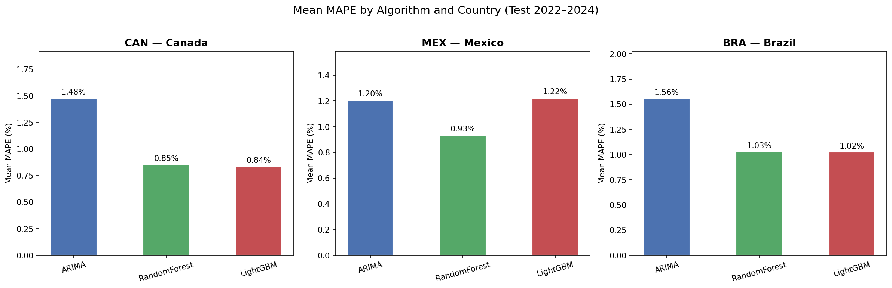
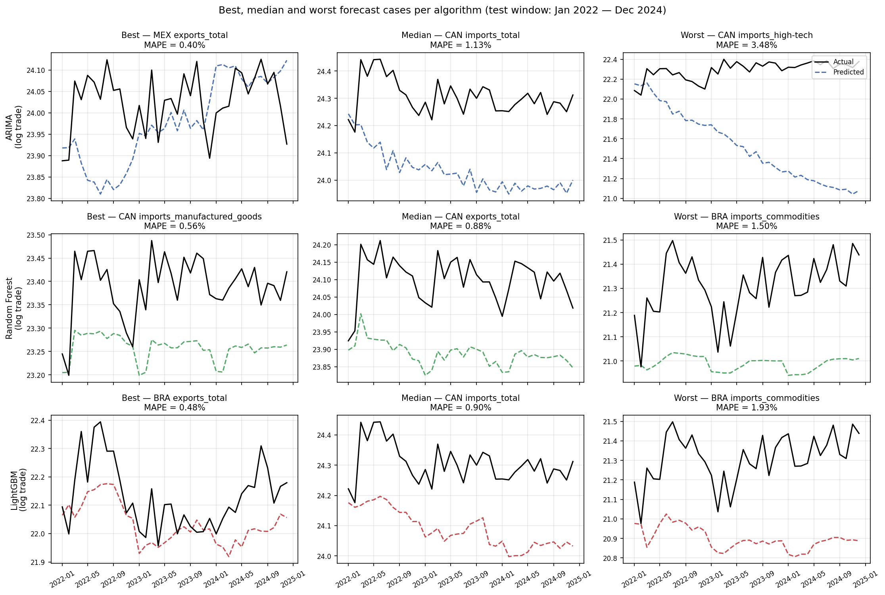
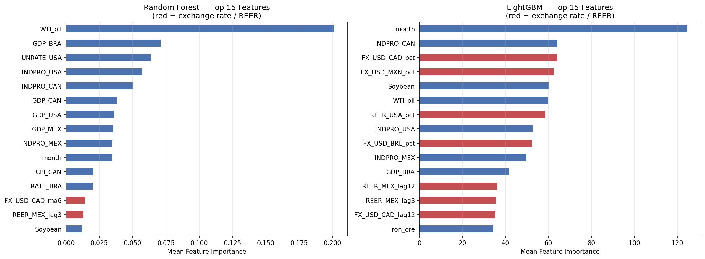
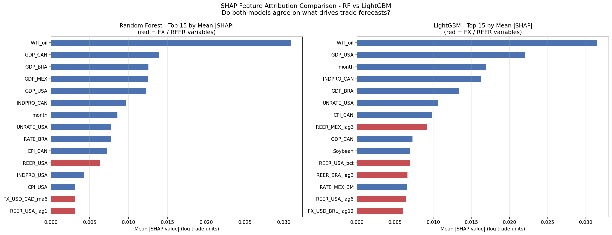

# 4 RESULTS

        The evaluation covered the 24 target series of bilateral U.S. trade flows with Canada, Mexico and Brazil over the out-of-sample period from January 2022 to December 2024. Three forecasting algorithms (ARIMA, Random Forest and LightGBM) were compared against a Naïve baseline using error metrics, statistical significance tests and explainability tools.

## 4.1 Descriptive statistics and data overview

        The final dataset held 180 monthly observations, from January 2010 to December 2024. Starting in 2010 was deliberate: it left enough post-Global Financial Crisis history to train on, while 2024 captured the most recent trade data available. The 24 target series kept the 3 × 2 × 4 design defined in Section 3.2: three countries, two directions and four sectors.

        All 73 input features were country-pair agnostic. The core set covered the three nominal exchange rates (USD/CAD, USD/MXN, USD/BRL) and Real Effective Exchange Rate (REER) indices, alongside macroeconomic controls: the Federal Funds Rate, WTI crude oil price, industrial production, CPI and GDP per capita. The rest came from feature engineering. It added lagged target values at 1, 3, 6 and 12 months, moving averages at 3, 6 and 12 months, percentage variations, and a binary indicator for the COVID-19 pandemic (2020–2021).

        Training covered January 2010 to December 2021. The out-of-sample test set held the final 36 months, January 2022 to December 2024.

## 4.2 Naïve baseline and information asymmetry

        Before comparing the models, the study set a Naïve baseline: each one-step-ahead forecast repeated the previous observed value (log y_t = log y_{t-1}). Across the 24 series, it reached a mean MAPE of 0.32%, lower than that of all three forecasting models.

        This result reflects an informational asymmetry. At each step of the test period, the Naïve predictor accessed the realized value of the previous observation. The RF and LightGBM models worked differently. Configured as direct 36-step-ahead forecasters, they trained on data through December 2021 and then produced all 36 predictions at once, with no access to intermediate realized values. ARIMA, although reestimated through walk-forward validation, generated one-step-ahead forecasts, a structurally simpler task than the 36-month direct forecast.

        The primary comparison therefore focuses on the three forecasting algorithms, with the Naïve baseline serving as an informational upper-bound reference only.

## 4.3 Model performance comparison

        Table 1 reports the mean MAPE for each model across the 24 target series. Random Forest achieved the lowest overall error (MAPE = 0.94%), followed by LightGBM (1.03%) and ARIMA (1.41%). At the series level, defined by lowest MAPE among the three algorithms, RF won in 9 of 24 series, ARIMA in 8 and LightGBM in 7.

**Table 1 — Mean MAPE by model across all 24 target series**

| Model          | Mean MAPE (%) | Series wins (of 24) |
|----------------|:-------------:|:-------------------:|
| Random Forest  | 0.9381        | 9                   |
| LightGBM       | 1.0276        | 7                   |
| ARIMA          | 1.4143        | 8                   |
| Naïve baseline | 0.3200        | —                   |

Source: the author (2026).

        Country-level disaggregation in Table 2 reveals that the ML advantage was consistent across the three trading partners, though its magnitude varied. In Canada the gap was widest: RF (0.85%) and LightGBM (0.84%) both substantially outperformed ARIMA (1.48%). Mexico was more mixed, with RF (0.93%) maintaining a clear margin over ARIMA (1.20%) while LightGBM (1.22%) performed comparably. For Brazil, RF (1.03%) and LightGBM (1.02%) surpassed ARIMA (1.56%), which registered the highest country-level error.

**Table 2 — Mean MAPE by country and model (%)**

| Country | ARIMA  | Random Forest | LightGBM |
|---------|:------:|:-------------:|:--------:|
| Canada  | 1.4781 | **0.8549**    | 0.8362   |
| Mexico  | 1.2042 | **0.9312**    | 1.2221   |
| Brazil  | 1.5606 | **1.0282**    | 1.0247   |

Source: the author (2026).

        By sector, the performance gap was most pronounced for high-technology products (0.91 pp for RF) and manufactured goods (0.46 pp), while commodities showed the smallest divergence (Table 3).

**Table 3 — Mean MAPE by sector and model (%)**

| Sector             | ARIMA  | Random Forest | LightGBM |
|--------------------|:------:|:-------------:|:--------:|
| Commodities        | 1.0768 | **0.9848**    | 1.1187   |
| Manufactured goods | 1.3989 | **0.9437**    | 1.0559   |
| High-technology    | 1.8006 | **0.8904**    | 0.9404   |
| Total (aggregate)  | 1.3811 | **0.9334**    | 0.9956   |

Source: the author (2026).

        Figure 1 visualizes the country-level MAPE breakdown, making the heterogeneous ML advantage visible across the three trading partners. Canada shows the widest gap between ARIMA and the ML models, while Mexico stands out for LightGBM's weaker relative performance. Brazil shows the most symmetric ML advantage, with RF and LightGBM nearly indistinguishable.

**Figure 1 — Mean MAPE by algorithm and country (test window: January 2022 to December 2024)**

Source: the author (2026).

        Figure 2 complements the aggregate metrics with concrete forecast examples, in a 3 × 3 grid showing the best, median and worst forecast cases for each algorithm. The best case corresponds to the series with the lowest MAPE for that algorithm, the median to the middle of the ranking, and the worst to the highest MAPE. The grid shows how model behavior varies across the 24 series.

**Figure 2 — Best, median and worst forecast cases per algorithm (test window: January 2022 to December 2024)**

Source: the author (2026).

## 4.4 Statistical significance tests

        **Friedman test.** A non-parametric Friedman test assessed whether predictive accuracy differed significantly across the three models, treating each of the 24 series as a block. The test yielded a p-value of 0.417, so the null hypothesis of no difference among models could not be rejected. The limited number of series (n = 24) partly explains this, constraining the test's statistical power. It does not mean the models are equivalent.

        **Diebold-Mariano test.** The Diebold-Mariano test, with the Harvey et al. (1997) small-sample correction, was applied to each of the 24 series across the three model pairs (Table 4). These are pairwise comparisons, unlike the series-level wins in Table 1, which reflect the best model among all three at once. RF was superior to ARIMA in 75% of the series (18 of 24); LightGBM outperformed ARIMA in 83% (20 of 24); and RF outperformed LightGBM in 83% (20 of 24). Together, these establish a consistent hierarchy (RF > LightGBM > ARIMA), with the ML advantage statistically supported across most series.

**Table 4 — Pairwise Diebold-Mariano test results (Harvey et al., 1997 correction)**

| Comparison              | Series where first model is superior |
|-------------------------|:------------------------------------:|
| RF vs. ARIMA            | 75% (18 of 24)                       |
| LightGBM vs. ARIMA      | 83% (20 of 24)                       |
| RF vs. LightGBM         | 83% (20 of 24)                       |

Source: the author (2026).

        **Ljung-Box test.** The Ljung-Box test examined the in-sample residuals of the 24 ARIMA models. Of these, 22 passed at the 5% significance level, showing no significant residual autocorrelation and adequate specification. Two series did not: Canadian exports of commodities (p = 0.0006) and Canadian total imports (p = 0.0146). This points to possible ARIMA misspecification, which may partly explain the model's weaker performance on them. The ACF plots of representative ARIMA residuals appear in Figure 6 (Appendix).

## 4.5 ARIMA versus ML performance gap

        The overall performance gap between ARIMA and the ML models was approximately 0.43 percentage points in favor of ML (0.48 pp against Random Forest and 0.39 pp against LightGBM). The gap was not uniform. In 8 of 24 series, ARIMA had a lower MAPE than both ML models, showing that the linear approach retained advantages under specific conditions. ARIMA's best cases showed lower volatility and more predictable structure, such as Mexican total exports (MAPE = 0.40%), Canadian exports of commodities (0.63%) and Brazilian exports and imports of high-technology products (0.58% each).

        For the two series with Ljung-Box violations (Canadian exports of commodities and Canadian total imports), ARIMA registered errors markedly higher than both ML models, suggesting residual misspecification as a contributing factor. Even excluding these two series, the average gap between ARIMA and RF remained at 0.51 percentage points, confirming that the ML advantage was not driven solely by ARIMA misspecification cases. The distribution of the gap across sectors appears in Figure 7 (Appendix).

## 4.6 Feature importance and SHAP analysis

        Feature importance and SHAP (SHapley Additive exPlanations) analyses were conducted for RF and LightGBM to identify the variables driving trade flow predictions. Figure 3 reports the top-15 feature importance scores across the 24 models per algorithm, highlighting exchange rate and REER variables. The SHAP summary plots for both models are presented side by side in Figure 8 (Appendix), and the exchange rate dependence pattern in Figure 9 (Appendix).

**Figure 3 — Top-15 feature importance (FX and REER variables highlighted)**

Source: the author (2026).

        For Random Forest, the WTI crude oil price index emerged as the most influential feature, reflecting the central role of energy markets in trade volumes, particularly in the commodity-intensive Canada–U.S. and Brazil–U.S. corridors. Among exchange rate variables, the six-month moving average of the USD/CAD rate (FX_USD_CAD_ma6, Rank 13) was the most relevant FX predictor, consistent with the model capturing medium-term trend persistence in currency dynamics (left panel of Figure 8, Appendix).

        LightGBM relied even more on the exchange rate: the USD/CAD percentage change (FX_USD_CAD_pct) ranked third in global feature importance (right panel of Figure 8, Appendix).

        Although the top-ranked features differed between the two models, a consistent pattern stood out. RF assigned greater weight to lagged levels and moving averages (which capture accumulated trend information), while LightGBM placed higher weight on percentage change features (capturing short-term directional movements). Figure 4 illustrates this complementarity, comparing mean absolute SHAP values side by side with FX and REER features highlighted in red.

**Figure 4 — Comparative SHAP feature importance: Random Forest versus LightGBM (top-15 features each, FX/REER highlighted)**

Source: the author (2026).

        SHAP dependence plots map the directional response of trade flows to exchange rate variation. Figure 9 (Appendix) shows the LightGBM SHAP contribution of the bilateral exchange rate for total exports and total imports of each country pair, revealing the asymmetric transmission of currency movements to exports and imports.

        The presence of exchange rate variables among the top predictors of both models confirmed that exchange rate fluctuations exerted a measurable and directionally consistent influence on bilateral trade flows, answering the primary research question.

## 4.7 Exchange rate sensitivity by country and sector

        To quantify the sensitivity of each country-sector combination to exchange rate dynamics, a composite FX sensitivity metric was built as the mean absolute SHAP value of FX and REER features across the 24 series, averaged between RF and LightGBM. The resulting heatmap is shown in Figure 5.

**Figure 5 — Exchange rate sensitivity heatmap (mean |SHAP| of FX and REER features, averaged between Random Forest and LightGBM)**

Source: the author (2026).

        Brazil emerged as the most exchange-rate-sensitive trading partner, with imports of manufactured goods registering the highest sensitivity in the entire heatmap (0.0044). Canada exhibited the lowest FX sensitivity across all sectors. Mexico occupied an intermediate position, though its imports of high-technology products showed elevated sensitivity (0.0033), above the Brazil equivalent.

        At the sectoral level, the pattern varied by trade direction. On the exports side, commodities showed the highest sensitivity across the three country pairs. On the imports side, manufactured goods led, driven particularly by Brazil. High-technology products and manufactured goods exports registered the lowest sensitivities overall, suggesting that more complex and differentiated trade flows were comparatively less exposed to short-term currency movements.

## 4.8 Synthesis of findings

        Exchange rate variables appeared among the most relevant predictors in both machine learning models (Figures 3 and 4), confirming that exchange rate fluctuations had measurable predictive content for bilateral trade flows. Random Forest was the most accurate model (mean MAPE 0.94%), and the Diebold-Mariano test confirmed its superiority over ARIMA in 75% of the series and over LightGBM in 83% (Table 4), establishing the hierarchy RF > LightGBM > ARIMA. Sensitivity varied systematically across countries and sectors (Figure 5): Brazil was the most sensitive partner and Canada the least, and the sectoral pattern differed by trade direction. Exports of commodities and imports of manufactured goods showed the highest sensitivity, while exports of manufactured goods and high-technology products showed the lowest. The temporal analysis (objective d) showed that RF weighted six-month moving averages to capture medium-term currency trends, while LightGBM relied on monthly percentage-change features for short-term shifts.
