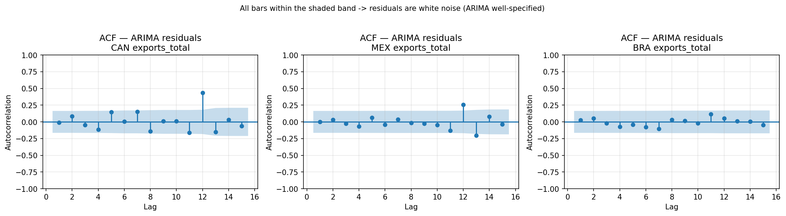
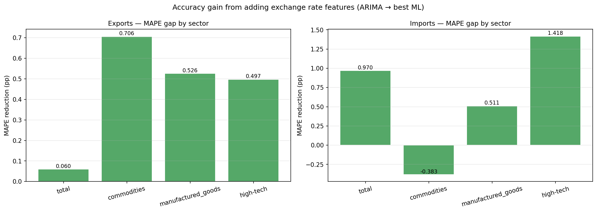
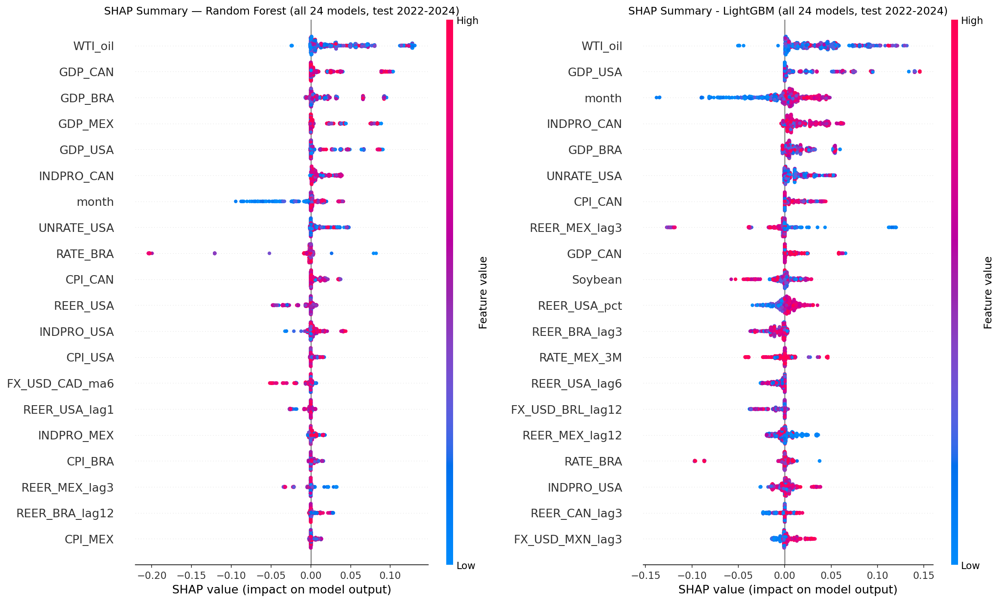
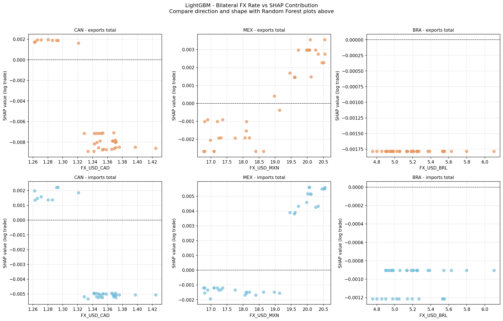

# APPENDIX — COMPLEMENTARY EVALUATION FIGURES

        This appendix gathers complementary figures from the evaluation phase referenced in Section 4 (Results). They support the diagnostic and interpretability analyses without being essential to the main narrative.

**Figure 6 — ACF plots of ARIMA in-sample residuals (representative series)**

Source: the author (2026).

**Figure 7 — ARIMA versus ML performance gap by sector (percentage points of MAPE)**

Source: the author (2026).

**Figure 8 — SHAP summary plots: Random Forest (left) and LightGBM (right), 864 test observations across 24 series**

Source: the author (2026).

**Figure 9 — SHAP dependence plots: LightGBM bilateral exchange rate effect on exports and imports**

Source: the author (2026).
